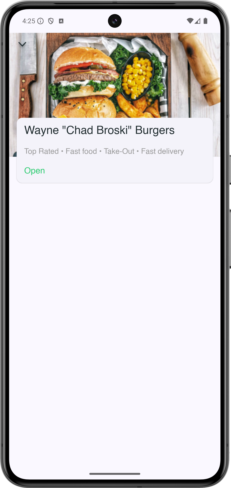

# Munchies
Munchies is a test Android application that helps users discover restaurants and quickly find places that match their preferences.

### Features

* Display a list of restaurants on the main screen
* Filter restaurants
* View detailed restaurant information
* Simple and user-friendly navigation

### Purpose

This project was created as a test assignment to demonstrate:
* Building UI using Jetpack Compose
* List rendering and filtering logic
* State management
* Clean architecture and navigation

## Screenshots

   

# Getting Started

To run the application, please download the latest release from the Releases section.
